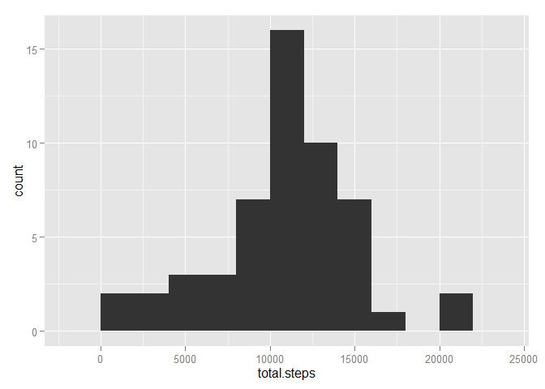
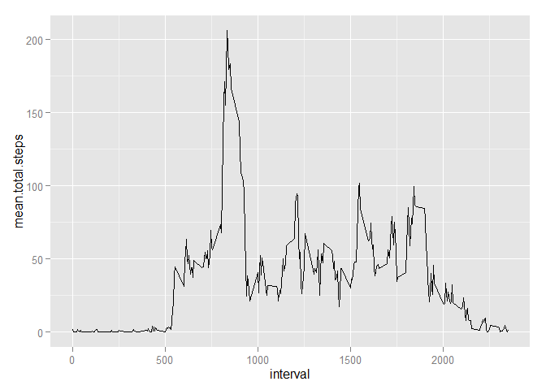
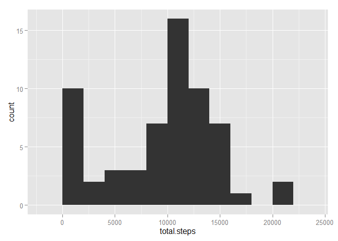
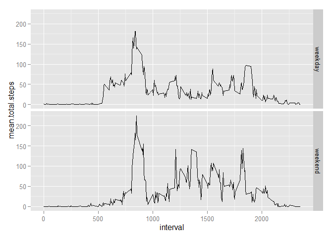

# Reproducible Research - Peer Assessment 1
iveletic  

### Introduction

This assignment makes use of data from a personal activity monitoring device.
This device collects data at 5 minute intervals through out the day. The data
consists of two months of data from an anonymous individual collected during the
months of October and November, 2012 and include the number of steps taken in 5
minute intervals each day.

The code included in this document is dependent on the following R packages:

* [knitr](http://www.rdocumentation.org/packages/knitr) --
for markdown processing
* [dplyr](http://www.rdocumentation.org/packages/dplyr) --
for data reshaping
* [ggplot2](http://www.rdocumentation.org/packages/ggplot2) --
for data visualization


```r
library(knitr)
library(dplyr)
library(ggplot2)
```

The global options are set as follows:

```r
options(digits = 2)
options(scipen = 999)
opts_chunk$set(echo = TRUE)
```

### Loading and preprocessing the data

First the data is downloaded and unzipped using the parameters bellow
(that is unless the file is already present in the working directory):

```r
dataUrl  <- "https://d396qusza40orc.cloudfront.net/repdata/data/activity.zip"
dataFile <- "activity.csv"
```


```r
if(!file.exists(dataFile)) {
    temp <- tempfile()
    download.file(dataUrl, temp)
    unzip(temp, dataFile) 
    unlink(temp)
}
```

The data is then loaded and transformed into a format suitable for the analysis:

```r
dataSet <- read.csv(dataFile,
                    colClasses = c("integer", "Date", "integer"))
```

### What is mean total number of steps taken per day?

The total number of steps taken per day is calculated while ignoring the missing
values in the dataset:

```r
totalStepsPerDay <- dataSet %>%
    na.omit() %>%
    group_by(date) %>%
    summarize(total.steps = sum(steps)) %>%
    ungroup()
totalStepsPerDay
```

```
## Source: local data frame [53 x 2]
## 
##          date total.steps
## 1  2012-10-02         126
## 2  2012-10-03       11352
## 3  2012-10-04       12116
## 4  2012-10-05       13294
## 5  2012-10-06       15420
## 6  2012-10-07       11015
## 7  2012-10-09       12811
## 8  2012-10-10        9900
## 9  2012-10-11       10304
## 10 2012-10-12       17382
## ..        ...         ...
```

Based on the resulting set a histogram of the total number of steps taken each
day is made:

```r
ggplot(data = totalStepsPerDay,
       aes(x = total.steps)) +
    geom_histogram(binwidth = 2000)
```

 

Both the mean and median of the total number of steps taken per day are
calculated and reported:

```r
meanTotalStepsPerDay <- totalStepsPerDay %>%
    summarize(mean.total.steps = mean(total.steps))
meanTotalStepsPerDay
```

```
## Source: local data frame [1 x 1]
## 
##   mean.total.steps
## 1            10766
```

```r
medianTotalStepsPerDay <- totalStepsPerDay %>%
    summarize(median.total.steps = median(total.steps))
medianTotalStepsPerDay
```

```
## Source: local data frame [1 x 1]
## 
##   median.total.steps
## 1              10765
```

### What is the average daily activity pattern?

The number of steps taken is then averaged across all days in 5-minute
intervals, once again ignoring the missing values in the dataset:

```r
meanStepsByInterval <- dataSet %>%
    na.omit() %>%
    group_by(interval) %>%
    summarize(mean.total.steps = mean(steps)) %>%
    ungroup()
meanStepsByInterval
```

```
## Source: local data frame [288 x 2]
## 
##    interval mean.total.steps
## 1         0            1.717
## 2         5            0.340
## 3        10            0.132
## 4        15            0.151
## 5        20            0.075
## 6        25            2.094
## 7        30            0.528
## 8        35            0.868
## 9        40            0.000
## 10       45            1.472
## ..      ...              ...
```

Based on the resulting set a time series plot is made:

```r
ggplot(data = meanStepsByInterval,
       aes(x = interval,
           y = mean.total.steps)) +
    geom_line()
```

 

Finally, the 5-minute interval, on average across all the days in the dataset,
that contains the maximum number of steps is calculated and reported:

```r
maxMeanStepsInterval <- meanStepsByInterval %>%
    filter(mean.total.steps == max(mean.total.steps))
maxMeanStepsInterval
```

```
## Source: local data frame [1 x 2]
## 
##   interval mean.total.steps
## 1      835              206
```

### Imputing missing values

Next, the total number of rows with missing values in the dataset is calculated
and reported:

```r
totalMissingValues <- dataSet %>%
    summarize(missing.values.count = sum(is.na(steps)))
totalMissingValues
```

```
##   missing.values.count
## 1                 2304
```

Strategy is devised to fill in all of the missing values in the dataset with the
**median value of total steps taken in the correspoding interval**. A new
dataset is created that is equal to the original one but with the missing data
filled in according to the described strategy:

```r
new_dataSet <- dataSet %>%
    group_by(interval) %>%
    mutate(steps = replace(steps, is.na(steps),
                           median(steps, na.rm = TRUE))) %>%
    ungroup()
new_dataSet
```

```
## Source: local data frame [17,568 x 3]
## 
##    steps       date interval
## 1      0 2012-10-01        0
## 2      0 2012-10-01        5
## 3      0 2012-10-01       10
## 4      0 2012-10-01       15
## 5      0 2012-10-01       20
## 6      0 2012-10-01       25
## 7      0 2012-10-01       30
## 8      0 2012-10-01       35
## 9      0 2012-10-01       40
## 10     0 2012-10-01       45
## ..   ...        ...      ...
```

The total number of steps taken each day is calculated anew:

```r
new_totalStepsPerDay <- new_dataSet %>%
    group_by(date) %>%
    summarize(total.steps = sum(steps)) %>%
    ungroup()
new_totalStepsPerDay
```

```
## Source: local data frame [61 x 2]
## 
##          date total.steps
## 1  2012-10-01        1141
## 2  2012-10-02         126
## 3  2012-10-03       11352
## 4  2012-10-04       12116
## 5  2012-10-05       13294
## 6  2012-10-06       15420
## 7  2012-10-07       11015
## 8  2012-10-08        1141
## 9  2012-10-09       12811
## 10 2012-10-10        9900
## ..        ...         ...
```

Based on the resulting set a new histogram is made:

```r
ggplot(data = new_totalStepsPerDay,
       aes(x = total.steps)) +
    geom_histogram(binwidth = 2000)
```

 

Again both mean and median total number of steps taken per day are calculated
and reported:

```r
new_meanTotalStepsPerDay <- new_totalStepsPerDay %>%
    summarize(mean.total.steps = mean(total.steps))
new_meanTotalStepsPerDay
```

```
## Source: local data frame [1 x 1]
## 
##   mean.total.steps
## 1             9504
```

```r
new_medianTotalStepsPerDay <- new_totalStepsPerDay %>%
    summarize(median.total.steps = median(total.steps))
new_medianTotalStepsPerDay
```

```
## Source: local data frame [1 x 1]
## 
##   median.total.steps
## 1              10395
```

In summary, the differences between estimates of the total daily number of steps
from the first part of the assignment and newly calculated values are given as
follows:

Total Steps per Day | Previously Estimated       | Newly Calculated               | Difference
------------------- | -------------------------- | ------------------------------ | ------------------------------------------------------
**Mean**            | 10766.19   | 9503.87   | 1262.32
**Median**          | 10765 | 10395 | 370

### Are there differences in activity patterns between weekdays and weekends?

A new factor variable in the dataset with two levels, "weekday" and "weekend",
indicating whether a given date is a weekday or weekend day, is created:

```r
dayTypes <- factor(c(rep("weekday", 5), rep("weekend", 2)))
new_dataSet <- new_dataSet %>%
    mutate(day.type = dayTypes[as.factor(as.POSIXlt(date)$wday)])
new_dataSet
```

```
## Source: local data frame [17,568 x 4]
## 
##    steps       date interval day.type
## 1      0 2012-10-01        0  weekday
## 2      0 2012-10-01        5  weekday
## 3      0 2012-10-01       10  weekday
## 4      0 2012-10-01       15  weekday
## 5      0 2012-10-01       20  weekday
## 6      0 2012-10-01       25  weekday
## 7      0 2012-10-01       30  weekday
## 8      0 2012-10-01       35  weekday
## 9      0 2012-10-01       40  weekday
## 10     0 2012-10-01       45  weekday
## ..   ...        ...      ...      ...
```
 
The number of steps taken is then averaged in 5-minute intervals across all
weekday days and all weekend days:

```r
new_meanStepsByInterval <- new_dataSet %>%
    group_by(interval, day.type) %>%
    summarize(mean.total.steps = mean(steps)) %>%
    ungroup()
new_meanStepsByInterval
```

```
## Source: local data frame [576 x 3]
## 
##    interval day.type mean.total.steps
## 1         0  weekday            2.068
## 2         0  weekend            0.000
## 3         5  weekday            0.409
## 4         5  weekend            0.000
## 5        10  weekday            0.159
## 6        10  weekend            0.000
## 7        15  weekday            0.182
## 8        15  weekend            0.000
## 9        20  weekday            0.091
## 10       20  weekend            0.000
## ..      ...      ...              ...
```

Based on the resulting dataframe a panel plot containing time series plots is
made:

```r
ggplot(data = new_meanStepsByInterval,
       aes(x = interval,
           y = mean.total.steps)) +
    geom_line() +
    facet_grid(day.type ~ .)
```

 
